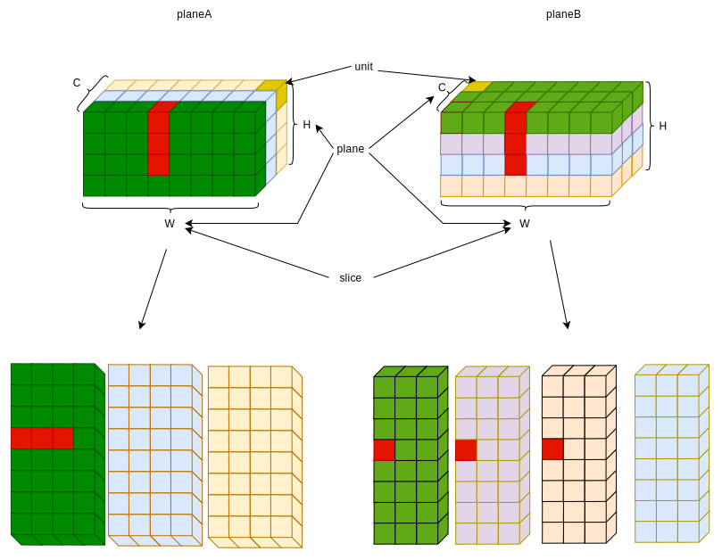

# README

## addr info

```
[5:0]   - byteIdx
[19:6]  - entryIdx
[22:20] - bankIdx
```


## function

- feature cube address generate 

## Tensor descriptor

### skip/stride

  * unit skip
  * slice skip
  * plane skip
  * cube skip


### num/dim

  * unit number
  * slice number
  * plane number
  * cube number




## run

```bash
$ make
```
